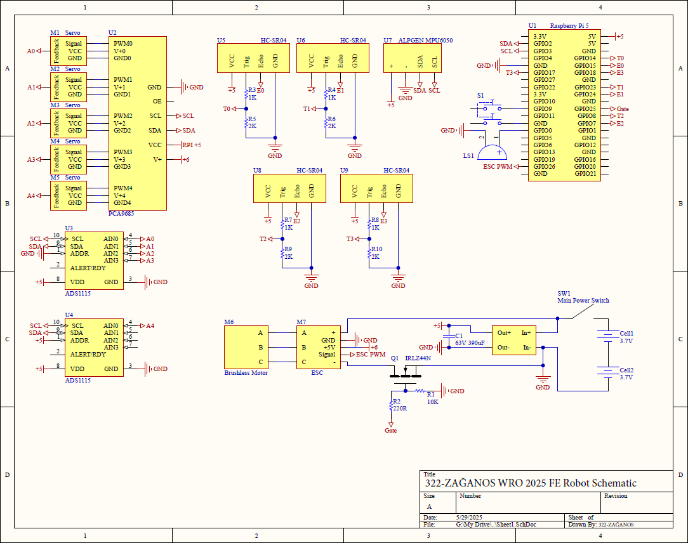

# WRO2025 Future Engineers – *322-ZAĞANOS*

Repository of *322-ZAĞANOS* competing in the **World Robot Olympiad (WRO) 2025** Future Engineers category.

---

## 📚 Table of Contents

* [👥 The Team](#the-team)
* [🎯 Challenge Overview](#challenge-overview)
* [🤖 Our Robot](#our-robot)
* [🚗 Mobility Management](#mobility-management)
* [🛠️ Power and Sense Management](#power-and-sense-management)
* [📝 Obstacle Management](#obstacle-management)
* [📽️ Performance Videos](#performance-videos)
* [💰 Cost Analysis](#cost-analysis)
* [⚠️ Reflection and Improvements](#reflections-and-improvements)
* [📂 Resources](#resources) 

---

## 👥 The Team <a id="the-team"></a>


| Name            | Age | School / Institution                             | Role            |
| --------------- | --- | ------------------------------------------------ | --------------- |
| Rüzgar Yılmaz (middle)   | 16  | İzmir Bahçeşehir 50. Yıl Fen ve Teknology Lisesi | Electronics     |
| Emir Gündoğan (right)   | 16  | İzmir Bahçeşehir 50. Yıl Fen ve Teknology Lisesi | Coding          |
| Deha Bora Çelik (left) | 16  | İzmir Bahçeşehir 50. Yıl Fen ve Teknology Lisesi | Mechanics (CAD) |

---

## 🎯 Challenge Overview <a id="challenge-overview"></a>

The **WRO 2025 Future Engineers** challenge requires developing a **fully autonomous vehicle** that navigates a **dynamic, randomized racetrack** using sensors, computer vision, and control algorithms, completing multiple laps and performing a parallel parking maneuver.

* **Open Challenge**: Complete three (3) laps on a track with randomized interior walls.
* **Obstacle Challenge**: Detect and respond to colored markers:

  * 🟥 Red → Stay right.
  * 🟩 Green → Stay left.
* **Parking**: After laps, identify and execute precise parallel parking in a designated zone.

🔗 **Official Rules**: [WRO 2025 Future Engineers General Rules](https://wro-association.org/wp-content/uploads/WRO-2025-Future-Engineers-Self-Driving-Cars-General-Rules.pdf)

---

## 🤖 Our Robot <a id="our-robot"></a>
**Controller:**  
We use a **Raspberry Pi 5** for all processing, including sensor fusion, control, and computer vision tasks.

**Vision Sensor:**  
**PixyCam v2** is our key component for detecting colored traffic signs. It allows fast and accurate lane decisions, making it vital for obstacle challenge and direction changes.

**Filament Used:**  
Our chassis and custom mounts were fully 3D-printed using approximately **1 kg of PETG**.

**Steering System:**  
Two synchronized **servo motors** handle front-wheel steering, ensuring smooth directional control—especially useful in tasks like parallel parking.

**Motion Control:**  
A single motor with **ESC** is used for forward/backward movement only, following competition constraints.

**Sensors:**  
- Dual **ultrasonic sensors** on servos detect obstacles on the sides.  
- **MPU6050 gyro** helps the robot stay aligned after each maneuver.  
- **ADS1115 ADC** reads servo positions for dynamic adjustment.

This setup gives us precise obstacle handling and reliable performance in autonomous driving challenges.


---

## 🚗 Mobility Management <a id="mobility-management"></a>

### ⚙️ Chassis & Drivetrain

🧱 Chassis
The chassis is built using a custom frame made from PETG. We designed it to support three levels using spacers between each layer. It keeps everything compact and organized while making sure all the components are easy to access for adjustments or upgrades.

🔽 3 Levels – What’s on Each One

1️⃣ Level 1 – Drive Base & Sensors

This bottom layer includes:

* The DC motor and full drivetrain system
* Wheels, gears, and axles
* Ultrasonic sensors with servos for real-time wall detection

2️⃣ Level 2 – Electronics

This second layer includes:

* 5V 3A Voltage Regulator
* A prototype perfboard for expansion
* All of our electronics

3️⃣ Level 3 – Processing, Vision and Controllers

This third layer includes:

* Raspberry Pi 5 runs the high-level code and processes image data
* The Pixy2 camera is mounted with a servo here for top-view vision
* Servo controller 
* ESC

🚗 Drivetrain

We are using a high-torque brushless DC motor (you’ll see it in the back, with the red end cap). Power goes through a custom planetary gear reduction system and is transferred using bevel and spur gears. It drives both front and rear wheels via shafts, so it’s a kind of 4-wheel-drive layout. The drivetrain is compact, and we’ve geared it to balance speed and torque well. 

And for steering, we’re using a servo-based steering mechanism. Two servos are directly connected to the front wheels, rotating the wheels mechanically. This gives us smooth and responsive real-angle steering, instead of relying on differential wheel speeds. It’s way more precise and especially useful for tasks like tight maneuvers and parallel parking.

---

## 🛠️ Power and Sense Management <a id="power-and-sense-management"></a>

| Component         | Specification         | Function                      |
| ----------------- | --------------------- | ----------------------------- |
| Raspberry Pi 5 | 8 GB RAM, 1.8 GHz CPU | Main controller |
| PixyCam v2 | 60 FPS, color-based   | Traffic sign detection |
| Battery | 2S 5000mAh 60C Li-Po | Supplies vehicle with 7.4V |
| Voltage Regulator | LM2596 5V 3A step-down voltage regulator | Provides 5V to logic level components |
| Mosfet | IRLZ44N | Turns the ESC on/off |
| ESC | Quicrun 10BL60 G2 60amp ESC | Allows control over the motor with RPI 5 |
| Motor | Quicrun 3660SL-3700KV-D5.0-G2 | Provides power to wheels |
| ADC | ADS1115 | Allows analog inputs |
| Gyro | MPU6050 | Provides rotational data |
| Servo | MG90S | Allows high-precision control over robot |
| Servo Driver | PCA9685 | Allows control over multiple servos |



---

## 📝 Obstacle Management <a id="obstacle-management"></a>

### 🏁 Open Round

During the Open Round, the robot uses side-mounted ultrasonic sensors on servo motors to determine the appropriate turning direction based on the presence of obstacles. The logic is simple: if there is no obstacle on one side, the robot turns in that direction.

#### 🔎 Turn Decision Logic

```python
leftDistance = get_distance(UltrasonicL)
rightDistance = get_distance(UltrasonicR)

if leftDistance > 200:
    turnLeft()
elif rightDistance > 200:
    turnRight()
else:
    goStraight()
```

This ensures the robot follows a dynamic, obstacle-avoiding trajectory while maintaining consistent navigation throughout the randomized layout.

### 🚧 Obstacle Round

In the Obstacle Round, the robot performs all visual processing using a Pixy2 camera to detect traffic signs (red or green pillars). The camera returns object data in the following format:

```python
block_info = {
    'signature': self.blocks[index].m_signature,  # Color ID (1-7)
    'x': self.blocks[index].m_x,                  # X-coordinate of the block center
    'y': self.blocks[index].m_y,                  # Y-coordinate of the block center
    'width': self.blocks[index].m_width,          # Width of the block
    'height': self.blocks[index].m_height,        # Height of the block
    'angle': self.blocks[index].m_angle,          # Orientation (if applicable)
    'index': self.blocks[index].m_index,          # Pixy tracking ID
    'age': self.blocks[index].m_age               # Number of frames tracked
}
```

### 🧭 Steering Control via Object Tracking

The robot aligns itself with the detected object by comparing its X-coordinate (`block["x"]`) to a defined `target_x`. Both servos are adjusted accordingly to steer:

```python
error = target_x - block["x"]
angle = map(error, -max_deviation, max_deviation, LEFT_SERVO_MAX, RIGHT_SERVO_MIN)
kit.servo[left_servo].angle = angle
kit.servo[right_servo].angle = angle
```

This mechanism enables the robot to stay on course and follow the traffic rules defined by pillar colors.

---

## 📽️ Performance Videos <a id="performance-videos"></a>

> 🔗 **[YouTube Video Link](https://youtu.be/nIWwGna1cYI)**

---

## 💰 Cost Analysis <a id="cost-analysis"></a>

### Component Costs

| Component         | Quantity | Unit Price (\$) | Total (\$) |
| ----------------- | -------- | --------------- | ---------- |
| Raspberry Pi 5    | 1        | 102.22$         | 102.22$    |
| PixyCam v2        | 1        | 110.37$         | 110.37$    |
| 3D Filament (PETG)| 1 kg     | 21.17$          | 21.17$     |
| Battery           | 1        | 52.91$          | 52.91$     |
| Voltage Regulator | 1        | 2.56$           | 2.56$       |
| Mosfet            | 1        | 0.64$           | 0.64$       |
| ESC               | 1        | 48.87$          | 48.87$     |
| Motor             | 1        | 41.35$          | 41.35$     |
| Gyro              | 1        | 11.51$          | 11.51$     |
| Servo             | 7        | 3.72$           | 26.04$     |
| Servo Driver      | 1        | 4.13$           | 4.13$      |
| ADC               | 4        | 2.39$           | 9.56$      |
| **Total**         |          |                 | **431.33$** |

---

## ⚠️ Reflections & Improvements <a id="reflections-and-improvements"></a>
In this section, we reflect on the challenges, design flaws, and execution errors we encountered during development and testing. We also propose concrete improvements for future iterations.

🔧 Key Mistakes & Lessons Learned
| Issue             | Description                                                                                                                           | Proposed Improvement                                                                                      |
| ----------------- | ------------------------------------------------------------------------------------------------------------------------------------- | --------------------------------------------------------------------------------------------------------- |
| Overpowered Motor | The brushless motor we initially selected had excessive torque and RPM, making it difficult to control at low speeds.                 | Use a lower-KV, sensored motor better suited for precision and control in autonomous driving.             |
| Weight & Size     | The motor's weight increased the center of mass, affecting stability, and required a large 2-stage planetary gearbox to reduce speed. | Choose a more compact motor with balanced torque output to reduce size and simplify the drivetrain.       |
| Gearbox Footprint | The custom gearbox occupies a large portion of the chassis and limited our design flexibility.                                        | Redesign drivetrain layout with modularity in mind; consider belt-driven or simpler reduction mechanisms. |

These mistakes guided us to focus more on practical motor sizing, efficient mechanical design, and weight distribution for better control and future upgrades.

---

## 📂 Resources <a id="resources"></a>

* [Raspberry Pi 5](https://www.raspberrypi.com/products/raspberry-pi-5/)
* [PixyCam v2](https://pixycam.com/)
* ---
